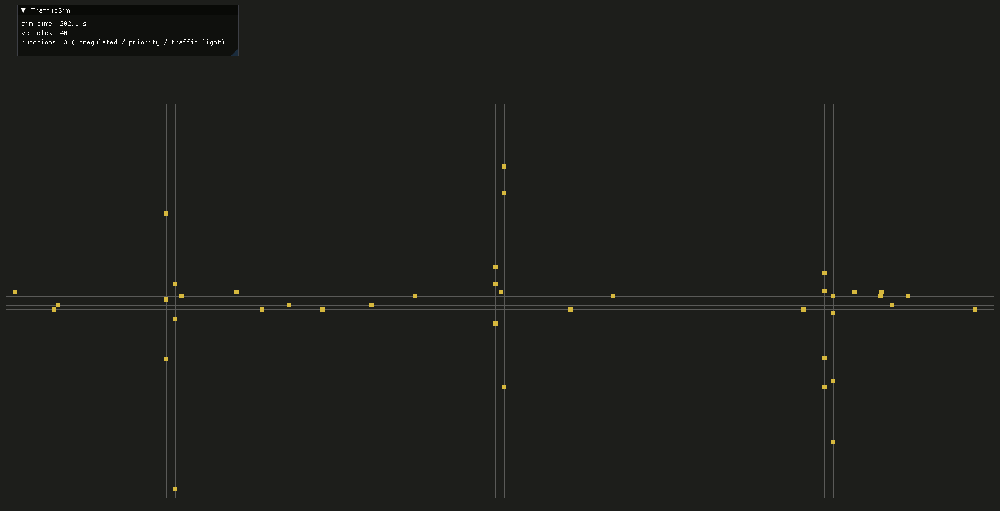

# TrafficSim

C++23 traffic simulation. Work in progress...

## Screenshot



## Quick start (devcontainer)

Open in VS Code → **Reopen in Container** → Ready to GO.

## Manual build

```bash
# Dependencies
conan install . --build=missing -s build_type=Debug

# configure + build
cmake --preset debug
cmake --build --preset debug

# Launch
./build/debug/trafficsim

# Tests
ctest --preset debug
```

## Presets

| Preset  | Description                     |
|---------|---------------------------------|
| debug   | Debug, without optimizations    |
| release | RelWithDebInfo                  |
| asan    | Debug + AddressSanitizer + UBSan|
| tsan    | Debug + ThreadSanitizer         |
